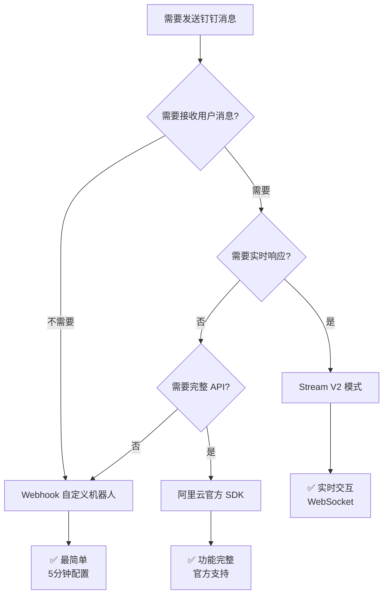

# DingTalk SDK

一个基于 Go 语言实现的钉钉机器人 SDK，提供完整的钉钉消息发送、接收、流式卡片等功能。

## 🎉 已验证可用的三种消息发送方式

| 方式 | 难度 | 推荐度 | 测试状态 |
|------|------|--------|---------|
| **Webhook 自定义机器人** | 🟢 最简单 | ⭐⭐⭐⭐⭐ | ✅ 已验证 |
| **Stream V2 模式** | 🟡 中等 | ⭐⭐⭐⭐ | ✅ 已验证 |
| **阿里云官方 SDK** | 🟡 中等 | ⭐⭐⭐⭐ | ✅ 已验证 |

**测试群**: 银河护卫队科技有限公司  
**测试日期**: 2026-02-07  
**测试结果**: 所有方式均成功发送消息 ✅

👉 **[完整使用指南](docs/USAGE_GUIDE.md)** - 包含详细配置步骤和测试案例
### 安装

```bash
go get github.com/difyz9/dingtalk-sdk.git
```

### 方式一：Webhook（最简单，5分钟上手）

```go
package main

import (
    "github.com/difyz9/dingtalk-sdk.git/client"
)

func main() {
    webhookURL := "https://oapi.dingtalk.com/robot/send?access_token=YOUR_TOKEN"
    
    msg := map[string]interface{}{
        "msgtype": "text",
        "text": map[string]interface{}{
            "content": "📢 测试消息",
        },
    }
    
    client.SendWebhookMessage(webhookURL, msg)
}
```

**获取 Webhook URL**: 钉钉群设置 → 智能群助手 → 添加机器人 → 自定义

### 方式二：Stream V2（支持交互）

```go
package main

import (
    "context"
    streamclient "github.com/open-dingtalk/dingtalk-stream-sdk-go/client"
)

func main() {
    cli := streamclient.NewStreamClient(
        streamclient.WithAppCredential(
            streamclient.NewAppCredentialConfig("ClientID", "ClientSecret"),
        ),
    )
    
    cli.Start(context.Background())
    defer cli.Close()
    select {}
}
```

### 方式三：阿里云官方 SDK（功能完整）

```go
package main

import (
    "github.com/difyz9/dingtalk-sdk.git/client"
    dingtalkrobot "github.com/alibabacloud-go/dingtalk/robot_1_0"
    "github.com/alibabacloud-go/tea/tea"
)

func main() {
    // 获取 AccessToken
    credential := client.Credential{
        ClientID:     "your_client_id",
        ClientSecret: "your_client_secret",
    }
    dingClient := client.NewDingTalkClient(credential)
    accessToken, _ := dingClient.GetAccessToken()
    
    // 使用阿里云 SDK 发送
    aliClient, _ := dingtalkrobot.NewClient(&openapi.Config{
        Protocol: tea.String("https"),
        RegionId: tea.String("central"),
    })
    
    // 发送消息...
}
```

📖 **详细配置和测试案例**: [完整使用指南](docs/USAGE_GUIDE.md)

---

## 测试成功案例

### ✅ 案例 1: Webhook 发送消息
- **群聊**: 银河护卫队科技有限公司
- **消息类型**: 文本、Markdown、Link、ActionCard
- **结果**: 全部成功

### ✅ 案例 2: Stream V2 交互式回复
- **群聊**: 银河护卫队科技有限公司
- **会话 ID**: `cidGCUBTzi5e6/D2Drgx6UHT2cAEyncMJx6pMZePDxhb2k=`
- **功能**: 用户 @机器人发送消息，自动回复
- **结果**: 成功接收并回复

测试日志：
```
📩 收到第 1 条消息:
  发送人: 蜘蛛侠
  内容: help
  → 回复: 帮助信息
  ✅ 发送成功
```

### ✅ 案例 3: 阿里云 SDK 发送消息
- **API**: OrgGroupSend
- **OpenConversationId**: `cid1+dPH/0LUVUSBFDIcYjYSA==`
- **结果**: 发送成功

响应：
```json
{
  "statusCode": 200,
  "body": {
    "processQueryKey": "h2Jh2kbkPlnUZ6w3PBSaHaZXM/uYDtWB1UaA6Ihttow="
  }
}
```

---

## 如何选择发送方式？



**推荐**:
- 简单通知 → **Webhook**
- 智能客服 → **Stream V2**
- 企业应用 → **阿里云 SDK**

---

## 获取 chatID 的方法


### https://open.dingtalk.com/tools/explorer/jsapi?id=10303
- ✅ 钉钉机器人消息接收和发送
- ✅ 支持文本、Markdown、链接、ActionCard 等消息格式
- ✅ OAuth 2.0 认证和 AccessToken 管理
- ✅ **Stream V2 模式** - 官方推荐,无需公网 IP
- ✅ **阿里云官方 SDK 集成** - 已验证可用
- ✅ 流式卡片创建和更新
- ✅ 媒体文件（图片、视频、文件）上传
- ✅ Webhook 自定义机器人支持
- ✅ 自动 AccessToken 缓存和刷新

## 快速开始


### https://open.dingtalk.com/tools/explorer/jsapi?id=10303
获取 chatID 的方法


### 安装

```bash
go get github.com/difyz9/dingtalk-sdk.git
```

### 基础使用

#### 1. 创建钉钉客户端

```go
package main

import (
    "github.com/difyz9/dingtalk-sdk.git/client"
)

func main() {
    // 创建客户端
    credential := client.Credential{
        ClientID:     "your_client_id",
        ClientSecret: "your_client_secret",
    }
    
    dingClient := client.NewDingTalkClient(credential)
    
    // 获取 Access Token
    token, err := dingClient.GetAccessToken()
    if err != nil {
        panic(err)
    }
    
    println("Access Token:", token)
}
```

#### 2. 发送消息

##### 方式1: 通过 SessionWebhook 回复消息（响应式）

```go
package main

import (
    "github.com/difyz9/dingtalk-sdk.git/message"
)

func main() {
    // 接收到的消息（来自钉钉回调）
    receiveMsg := message.ReceiveMsg{
        SessionWebhook: "your_webhook_url", // 来自钉钉回调
        SenderNick:     "用户名",
        SenderStaffId:  "user_id",
        ConversationType: "2", // 1: 私聊, 2: 群聊
    }
    
    // 发送文本消息
    receiveMsg.ReplyToDingtalk(string(message.TEXT), "Hello, DingTalk!")
    
    // 发送 Markdown 消息
    markdownText := `**欢迎使用钉钉 SDK**

> 这是一个功能强大的 SDK

### 主要特性：
- ✅ 消息发送
- ✅ 流式卡片
- ✅ 媒体上传
`
    receiveMsg.ReplyToDingtalk(string(message.MARKDOWN), markdownText)
}
```

##### 方式2: 主动发送群消息（推送式）

```go
package main

import (
    "github.com/difyz9/dingtalk-sdk.git/client"
)

func main() {
    credential := client.Credential{
        ClientID:     "your_client_id",
        ClientSecret: "your_client_secret",
    }
    
    dingClient := client.NewDingTalkClient(credential)
    
    // 发送文本消息到群
    chatID := "your_chat_id" // 群的 chatId
    textMsg := map[string]interface{}{
        "msgtype": "text",
        "text": map[string]string{
            "content": "大家好！这是一条群消息 🤖",
        },
    }
    
    dingClient.SendRobotMessage(chatID, textMsg)
    
    // 发送 Markdown 消息到群
    markdownMsg := map[string]interface{}{
        "msgtype": "markdown",
        "markdown": map[string]string{
            "title": "系统通知",
            "text": `### 📢 重要通知
            
**状态**: 🟢 正常

> 数据更新时间: 2026-02-07
`,
        },
    }
    
    dingClient.SendRobotMessage(chatID, markdownMsg)
}
```

#### 3. 上传媒体文件

```go
package main

import (
## 完整示例程序

### 已验证可用的示例

| 示例 | 说明 | 状态 |
|------|------|------|
| [webhook/](examples/webhook/) | Webhook 自定义机器人 | ✅ 已测试 |
| [stream_v2/](examples/stream_v2/) | Stream V2 交互式机器人 | ✅ 已测试 |
| [alicloud_sdk/](examples/alicloud_sdk/) | 阿里云官方 SDK | ✅ 已测试 |

### 其他示例

- **[basic/](examples/basic/)** - 基础功能演示
- **[message/](examples/message/)** - 各种消息类型发送
- **[active_send/](examples/active_send/)** - 主动消息发送综合示例
- **[send_guide/](examples/send_guide/)** - 发送消息使用指南

## 文档

- 📖 **[完整使用指南](docs/USAGE_GUIDE.md)** - 详细配置步骤和测试案例 ⭐
- 📖 [快速开始](docs/QUICK_START.md) - 5分钟入门指南
- ⭐ [Stream V2 指南](docs/STREAM_V2_GUIDE.md) - Stream V2 完整文档
- 📝 [主动发送消息指南](docs/ACTIVE_SEND_GUIDE.md) - 主动消息发送完整指南
- 📚 [API 文档](docs/API.md) - 完整 API 参考
- 💬 [消息格式指南](docs/MESSAGE_GUIDE.md) - 消息类型详解
- 🔧 [实现总结](docs/IMPLEMENTATION_SUMMARY.md) - 技术实现说明
    
    if err != nil {
        panic(err)
    }
    
    println("Media ID:", result.MediaID)
}
```

#### 4. 流式卡片更新

```go
package main

import (
    "github.com/difyz9/dingtalk-sdk.git/stream"
    "github.com/google/uuid"
)

func main() {
    // 创建流式卡片客户端
    streamClient, err := stream.NewStreamCardClient()
    if err != nil {
        panic(err)
    }
    
    // 创建并投放卡片
    cardReq := &stream.CreateAndDeliverCardRequest{
        CardTemplateID:   "template_id",
        OutTrackID:       uuid.New().String(),
        OpenSpaceID:      "open_space_id",
        ConversationType: "2", // 群聊
        RobotCode:        "robot_code",
        CardData: map[string]string{
            "content": "初始内容",
        },
    }
    
    err = streamClient.CreateAndDeliverCard("access_token", cardReq)
    if err != nil {
        panic(err)
    }
    
    // 流式更新卡片内容
    updateReq := &stream.StreamingUpdateRequest{
        OutTrackID: cardReq.OutTrackID,
        Key:        "content",
        Content:    "更新后的内容",
        IsFull:     true,
        IsFinalize: true,
    }
    
    err = streamClient.StreamingUpdate("access_token", updateReq)
    if err != nil {
        panic(err)
    }
}
```

## 项目结构

```
dingtalk-sdk/
├── client/         # 钉钉客户端和认证
├── message/        # 消息接收和发送
├── stream/         # 流式卡片功能
├── examples/       # 使用示例
│   ├── basic/           # 基础使用
│   ├── message/         # 消息接收和回复
│   ├── send_message/    # 主动发送消息 (Webhook + OAuth)
│   ├── webhook/         # Webhook 自定义机器人
│   ├── stream/          # 流式卡片
│   ├── stream_v2/       # ⭐ Stream V2 模式 (推荐)
│   └── get_chat_list/   # 获取 OpenConversationId
├── docs/           # 文档
│   ├── QUICK_START.md          # 快速开始
│   ├── STREAM_V2_GUIDE.md      # ⭐ Stream V2 完整指南
│   ├── API.md                  # API 参考
│   ├── MESSAGE_GUIDE.md        # 消息格式指南
│   └── IMPLEMENTATION_SUMMARY.md # 实现总结
└── README.md
```

## 核心模式对比

| 特性 | Stream V2 模式 | Webhook 模式 | OAuth 模式 |
|------|---------------|--------------|-----------|
| 公网要求 | ❌ 不需要 | ✅ 需要 | ❌ 不需要 |
| 配置难度 | 🟢 简单 | 🟡 中等 | 🟢 简单 |
| 实时性 | 🟢 WebSocket | 🟡 HTTP | 🟡 主动推送 |
| 推荐场景 | 实时消息监听 | 简单通知 | 主动推送 |

**推荐使用**: Stream V2 模式 ⭐ (官方推荐，最简单可靠)

## 示例代码

### Stream V2 模式 (推荐) ⭐

```go
package main

import (
    "context"
    "github.com/open-dingtalk/dingtalk-stream-sdk-go/client"
    "github.com/open-dingtalk/dingtalk-stream-sdk-go/event"
    "github.com/open-dingtalk/dingtalk-stream-sdk-go/payload"
)

func OnEventReceived(ctx context.Context, df *payload.DataFrame) (*payload.DataFrameResponse, error) {
    eventHeader := event.NewEventHeaderFromDataFrame(df)
    println("收到事件:", eventHeader.EventType)
    return event.NewSuccessResponse()
}

func main() {
    cli := client.NewStreamClient(
        client.WithAppCredential(client.NewAppCredentialConfig(
            "your_client_id",
            "your_client_secret",
        )),
    )
    
    cli.RegisterAllEventRouter(OnEventReceived)
    
    cli.Start(context.Background())
    defer cli.Close()
    select {} // 阻塞主线程
}
```

更多示例请查看 [examples/](examples/) 目录。

## 完整示例程序

### 1. 基础示例
- **[basic/](examples/basic/)** - 基础功能演示
- **[message/](examples/message/)** - 各种消息类型发送示例

### 2. 主动发送消息
- **[webhook/](examples/webhook/)** - ✅ Webhook 自定义机器人（推荐，最简单）
- **[stream_v2/](examples/stream_v2/)** - ⭐ Stream V2 模式（官方推荐，支持交互）
- **[alicloud_sdk/](examples/alicloud_sdk/)** - ✅ 阿里云官方 SDK 方式（已验证可用）

### 3. 高级功能
- **[stream/](examples/stream/)** - 流式卡片演示
- **[active_send/](examples/active_send/)** - 主动消息发送完整指南

### 4. 测试工具
- **[quick_test/](examples/quick_test/)** - 快速测试工具
- **[send_guide/](examples/send_guide/)** - 发送消息使用指南

## 文档

- 📖 [快速开始](docs/QUICK_START.md) - 5分钟入门指南
- ⭐ [Stream V2 指南](docs/STREAM_V2_GUIDE.md) - **Stream V2 完整文档 (推荐)**
- 📚 [API 文档](docs/API.md) - 完整 API 参考
- 💬 [消息格式指南](docs/MESSAGE_GUIDE.md) - 消息类型详解
- 🔧 [实现总结](docs/IMPLEMENTATION_SUMMARY.md) - 技术实现说明

## API 文档

### Client 模块

- `NewDingTalkClient(credential Credential) *DingTalkClient` - 创建钉钉客户端
- `GetAccessToken() (string, error)` - 获取 AccessToken（自动缓存）
- `UploadMedia(content []byte, filename, mediaType, mimeType string) (*MediaUploadResult, error)` - 上传媒体文件

### Message 模块

- `ReplyToDingtalk(msgType, msg string) (int, error)` - 回复消息到钉钉
- `GetSenderIdentifier() string` - 获取发送者标识
- `GetChatTitle() string` - 获取聊天标题

### Stream 模块

- `NewStreamCardClient() (*StreamCardClient, error)` - 创建流式卡片客户端
- `CreateAndDeliverCard(accessToken string, req *CreateAndDeliverCardRequest) error` - 创建并投放卡片
- `StreamingUpdate(accessToken string, req *StreamingUpdateRequest) error` - 流式更新卡片

## 许可证

MIT License

## 鸣谢

本项目基于 [chatgpt-dingtalk](https://github.com/eryajf/chatgpt-dingtalk) 项目的钉钉模块改造而成。
